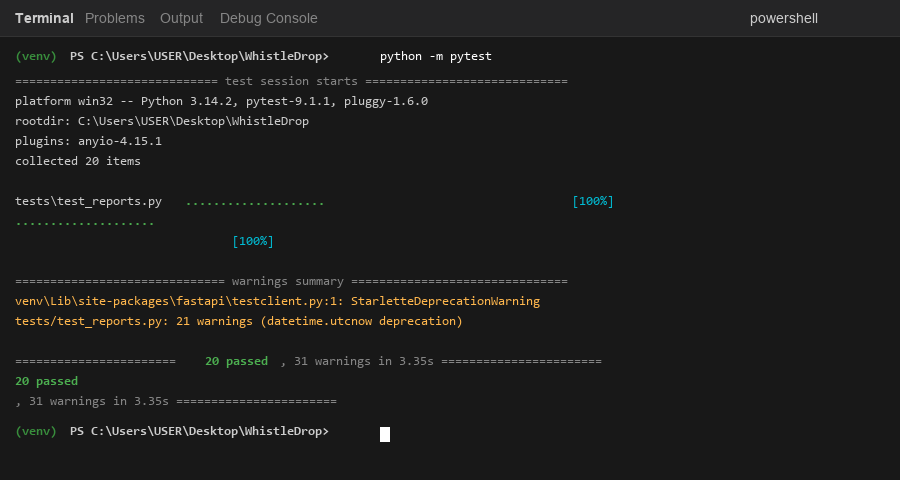
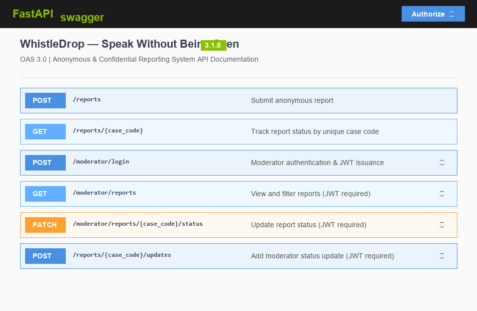
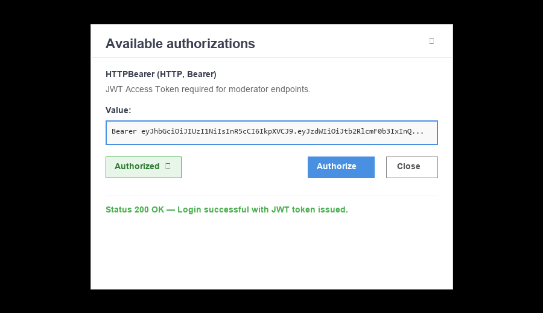
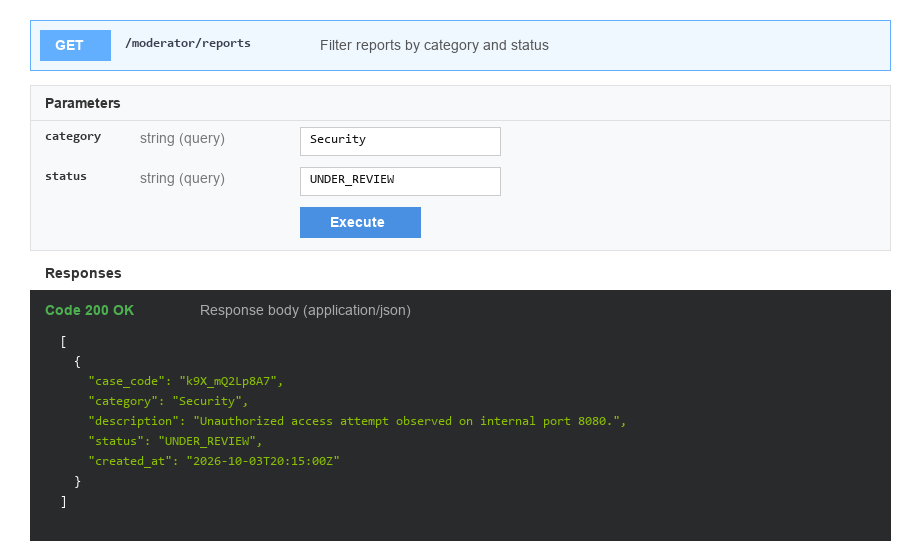
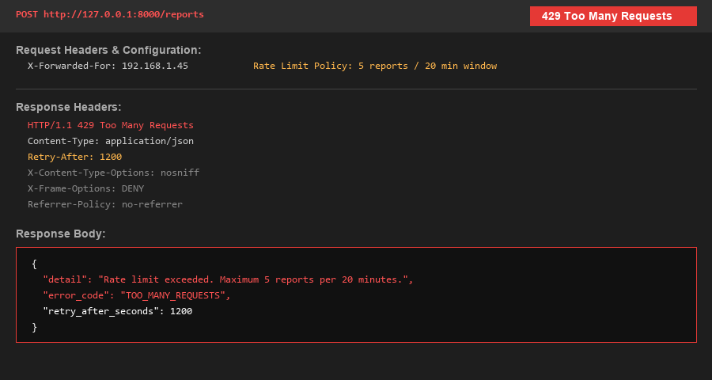

# WhistleDrop — Speak Without Being Seen

> A confidential and anonymous reporting backend that allows users to submit sensitive reports without creating an account, while providing authorized moderators with secure tools to review, filter, and manage reports.

---

## 📌 Overview

WhistleDrop is a privacy-focused reporting system designed for submitting confidential reports anonymously.

A reporter does not need to create an account. After submitting a report, the system generates a unique case code that can be used to track the report.

Moderators authenticate using a username and password and receive a JWT access token. The token is then used to access protected moderator APIs.

### Basic Workflow

```text
Reporter
   │
   ▼
Submit Anonymous Report
   │
   ▼
Unique Case Code
   │
   ▼
Track Report Status
```

```text
Moderator
   │
   ▼
Username + Password
   │
   ▼
JWT Access Token
   │
   ▼
Protected Moderator APIs
   │
   ▼
Review / Filter / Update Reports
```

---

# ✨ Features

## 1. Anonymous Reporting

Users can submit reports without creating an account.

Each report contains:

* Category
* Description
* Optional evidence/reference URL

Supported categories:

* Security
* Harassment
* Corruption
* Technical
* Other

### Endpoint

```http
POST /reports
```

---

## 2. Secure Case Code

Every report receives a randomly generated case code.

The case code is generated using Python's `secrets` module:

```python
secrets.token_urlsafe(12)
```

This prevents the system from exposing sequential database IDs as public case identifiers.

### Report tracking

```http
GET /reports/{case_code}
```

A reporter can use the case code to check:

* Category
* Current status
* Status updates
* Creation time

---

# 🔐 Moderator Authentication

Moderator functionality is protected using JWT authentication.

### Login

```http
POST /moderator/login
```

The moderator provides:

```text
Username
Password
```

The backend verifies the password against the stored password hash and generates a JWT access token.

```text
Username + Password
        │
        ▼
Verify Password
        │
        ▼
Generate JWT
        │
        ▼
Access Token
```

Protected requests use:

```http
Authorization: Bearer <access_token>
```

This means moderators do not need to send their username and password with every API request.

---

# 🛡️ Moderator APIs

The following endpoints require moderator authentication.

### Get Reports

```http
GET /moderator/reports
```

Returns reports available to authenticated moderators.

### Change Report Status

```http
PATCH /moderator/reports/{case_code}/status
```

Supported statuses:

```text
SUBMITTED
UNDER_REVIEW
RESOLVED
DISMISSED
```

### Add Status Update

```http
POST /reports/{case_code}/updates
```

Allows an authenticated moderator to add an update to a report.

---

# 🔎 Report Filtering

Moderators can filter reports using category and status.

### Filter by category

```http
GET /moderator/reports?category=Security
```

### Filter by status

```http
GET /moderator/reports?status=UNDER_REVIEW
```

### Filter by both

```http
GET /moderator/reports?category=Security&status=UNDER_REVIEW
```

Invalid category and status values are rejected through Pydantic validation.

---

# 🔒 Privacy & Security

WhistleDrop is designed around the privacy requirements of confidential reporting.

Implemented protections include:

### Password hashing

Moderator passwords are stored as password hashes rather than plaintext passwords.

### JWT authentication

Moderator APIs require a valid JWT access token.

### Generic authentication errors

Invalid usernames and passwords return a generic message:

```text
Invalid username or password
```

This prevents the API from revealing whether a particular moderator username exists.

### Secure case codes

Case codes are generated using Python's cryptographically secure `secrets` module.

### Explicit API responses

The moderator report endpoint explicitly selects the fields returned by the API instead of directly exposing the entire database model.

### Security headers

The API adds:

```text
X-Content-Type-Options: nosniff
X-Frame-Options: DENY
Referrer-Policy: no-referrer
```

### Rate limiting

Anonymous report submission is protected against repeated requests from the same IP.

Current configuration:

```text
Maximum: 5 reports
Time window: 20 minutes
```

Requests exceeding the limit receive:

```http
429 Too Many Requests
```

> The current rate limiter uses in-memory storage and is intended for the current project implementation. A production deployment with multiple server instances would use shared storage such as Redis.

---

# 🧪 Automated Testing

The project uses **Pytest** for automated testing.

Run the complete test suite:

```bash
python -m pytest
```

### Current test result

```text
20 passed
```

The tests cover functionality including:

* Report creation
* Report retrieval
* Request validation
* Moderator login
* Invalid credentials
* JWT authentication
* Unauthorized requests
* Status changes
* Invalid status values
* Status updates
* Category filtering
* Status filtering
* Combined filtering
* Invalid filters
* Rate limiting

---

# 📚 Swagger / OpenAPI

WhistleDrop uses FastAPI's built-in Swagger/OpenAPI documentation.

Start the server:

```bash
uvicorn app.main:app --reload
```

Open:

```text
http://127.0.0.1:8000/docs
```

Swagger provides interactive documentation for:

* Public APIs
* Moderator APIs
* Request schemas
* Response codes
* JWT authentication
* Category validation
* Status validation
* Filtering

---

# 🔌 API Reference

## Public Endpoints

| Method | Endpoint               | Description             | Authentication |
| ------ | ---------------------- | ----------------------- | -------------- |
| POST   | `/reports`             | Submit anonymous report | Not required   |
| GET    | `/reports/{case_code}` | Track report            | Not required   |

## Moderator Endpoints

| Method | Endpoint                                | Description          | Authentication |
| ------ | --------------------------------------- | -------------------- | -------------- |
| POST   | `/moderator/login`                      | Moderator login      | Not required   |
| GET    | `/moderator/reports`                    | View/filter reports  | JWT required   |
| PATCH  | `/moderator/reports/{case_code}/status` | Change report status | JWT required   |
| POST   | `/reports/{case_code}/updates`          | Add status update    | JWT required   |

---

# 🗄️ Database

WhistleDrop uses PostgreSQL with SQLAlchemy.

### Main entities

#### Report

```text
id
case_code
category
description
evidence_url
status
created_at
```

#### Moderator

```text
id
username
password_hash
```

#### StatusUpdate

```text
id
report_id
message
created_at
```

A report can contain multiple status updates.

---

# 🛠️ Tech Stack

| Technology        | Purpose                   |
| ----------------- | ------------------------- |
| Python            | Backend language          |
| FastAPI           | REST API framework        |
| PostgreSQL        | Database                  |
| SQLAlchemy        | ORM                       |
| Pydantic          | Data validation           |
| JWT               | Authentication            |
| Password Hashing  | Secure credential storage |
| Pytest            | Automated testing         |
| Swagger / OpenAPI | API documentation         |

---

# 📁 Project Structure

```text
WhistleDrop/
│
├── app/
│   ├── main.py
│   ├── auth.py
│   ├── database.py
│   ├── models.py
│   └── schemas.py
│
├── tests/
│   └── test_reports.py
│
├── create_moderator.py
├── requirements.txt
├── README.md
└── .gitignore
```

---

# ⚙️ Installation

## 1. Clone the repository

```bash
git clone <your-repository-url>
cd WhistleDrop
```

## 2. Create a virtual environment

### Windows

```powershell
python -m venv venv
```

Activate it:

```powershell
venv\Scripts\activate
```

## 3. Install dependencies

```powershell
pip install -r requirements.txt
```

## 4. Configure PostgreSQL

Create the required PostgreSQL database and configure the database connection used by the application.

Do not commit database passwords or other secrets to Git.

## 5. Run the application

```powershell
uvicorn app.main:app --reload
```

The API will be available at:

```text
http://127.0.0.1:8000
```

Swagger documentation:

```text
http://127.0.0.1:8000/docs
```

## 6. Run tests

```powershell
python -m pytest
```

Expected result:

```text
20 passed
```

---

# 📸 Screenshots

Important screenshots can be added to demonstrate the working project.

Recommended screenshots:

### Automated Tests

Show the final Pytest result:

```text
20 passed
```

```markdown

```

### Swagger Documentation

Show the `/docs` page containing the public and moderator APIs.

```markdown

```

### JWT Authentication

Show the moderator login and authenticated Swagger request.

```markdown

```

### Report Filtering

Show category/status filtering in Swagger.

```markdown

```

### Rate Limiting

Show the `429 Too Many Requests` response.

```markdown

```

> Do not include real passwords, JWT tokens, database credentials, or sensitive report information in screenshots.

---

# 📊 Current Project Status

| Feature                  | Status            |
| ------------------------ | ----------------- |
| Anonymous reporting      | ✅ Complete        |
| Case-code tracking       | ✅ Complete        |
| PostgreSQL database      | ✅ Complete        |
| Moderator authentication | ✅ Complete        |
| JWT authorization        | ✅ Complete        |
| Report status management | ✅ Complete        |
| Category filtering       | ✅ Complete        |
| Status filtering         | ✅ Complete        |
| Swagger/OpenAPI          | ✅ Complete        |
| Automated testing        | ✅ Complete        |
| Security headers         | ✅ Complete        |
| Explicit API responses   | ✅ Complete        |
| Rate limiting            | ✅ Complete        |
| Privacy protections      | ✅ Complete        |
| Permanent case closure   | ⏳ Not implemented |
| Evidence/file upload     | ⏳ Not implemented |
| Advanced search          | ⏳ Not implemented |
| Deployment               | ⏳ Not implemented |

---

# 🚧 Future Improvements

Possible future improvements include:

* Permanent case closure
* Evidence/file uploads
* Advanced report search
* Pagination
* Production-grade distributed rate limiting
* Additional security hardening
* Production deployment
* Monitoring and logging
* HTTPS configuration

---

# 👨‍💻 Project Status

WhistleDrop currently provides a functional anonymous reporting backend with:

```text
Anonymous Reporting
        +
Case Tracking
        +
Moderator Authentication
        +
JWT Authorization
        +
Report Management
        +
Filtering
        +
Privacy Protections
        +
Rate Limiting
        +
Swagger Documentation
        +
Automated Testing
```

### Test Status

```text
20 passed
```

---

## 📌 Note

WhistleDrop is currently a backend project focused on learning and demonstrating secure API development, database integration, authentication, privacy protections, automated testing, and API documentation.

Before using a system like this for real confidential reporting, additional production security measures, infrastructure hardening, monitoring, data-retention policies, and legal/privacy review would be required.
